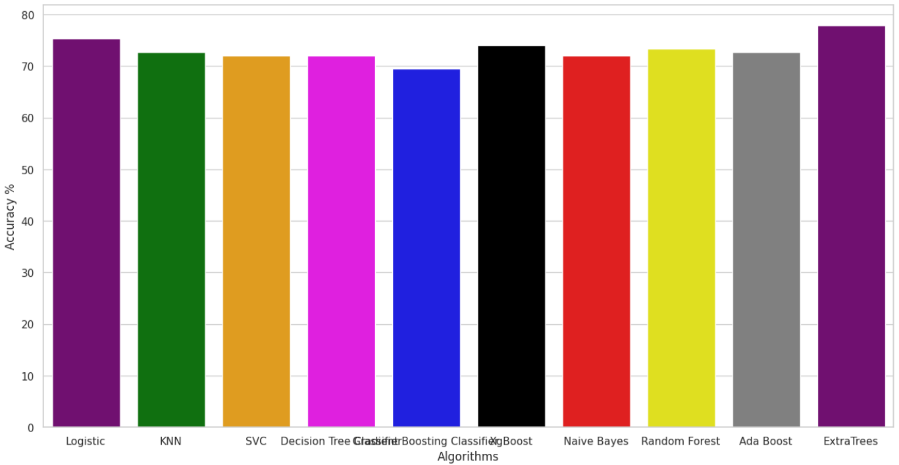

# AKBANK MACHINE LEARNING PROJECT

## Diyabetli Hasta Tahmini

Bu proje, sınıflandırma algoritmalarını kullanarak diyabetli hastaları tahmin etmeyi amaçlamaktadır. Projede Kaggle'dan bir veri seti kullanılmıştır.

## Veri Seti

Kullanılan veri seti [Pima Indians Diabetes Database](https://www.kaggle.com/datasets/uciml/pima-indians-diabetes-database) adlı veri setidir. Veri setini indirmek için lütfen bağlantıya tıklayın.

  
## Google Colab ile Çalıştırma

Proje kodlarını [Google Colab](https://colab.research.google.com/) üzerinde çalıştırabilirsiniz. Google Colab, Python kodlarını çevrimiçi olarak çalıştırmanıza ve GPU veya TPU gibi kaynaklardan ücretsiz olarak faydalanmanıza olanak tanır. Proje kodlarını Colab'da çalıştırmak için:

1. Veri setini indirin...
2. Kodları doğrudan Colab ortamına kopyalayın.
3. Gerekli kütüphaneleri yükleyin ve projeyi çalıştırın.
4. Kodları çalıştırarak veri seti üzerinde model eğitimi ve tahmin işlemlerini gerçekleştirin.

  
## Özellikler

- Veri setini Pandas, Matplotlib, Seaborn gibi ilgili kütüphaneleri kullanarak açıkladık.

- Görselleştirme kütüphaneleri ile veri setinden grafikler ve görseller oluşturduk.

[CorrelationMatrix](https://prnt.sc/xmtA-kLnBg8M)

- Pandas yöntemlerini kullanarak veri setine ait genel bilgileri aktardık.
- Veri setini temizledik, eksik değerleri doldurduk ve uygun yöntemlerle işledik.
- Veri kümesini eğittik ve test kümelerine böldük.
- Çapraz doğrulamayı(cross validation) kullanarak seçilen modellerin performanslarını
inceledik.
- En iyi performansı gösteren modeli bulduk. 

*** Detaylı açıklamalar ve kodlar IPYNB dosyasında mevcuttur.
## Karşılaştırılan Sınıflandırma Modelleri

- Logistic regresyon
- KNearestNeighbors
- DecisionTreeClassifier
- SVC
- XGBClassifier
- GradientBoostingClassifier
- Naive Bayes
- RandomForestClassifier
- AdaBoostClassifier
- ExtraTreesClassifier

[Karşılaştırma Sonuçları](https://prnt.sc/qi6KX4cjO_Sz)

## Yazarlar

- [@orcunbayraktar](https://github.com/orcunbayraktar) 

- [@cengizhanaltin](https://github.com/cengizhanaltin/) 

  
## Ekran Görüntüleri

